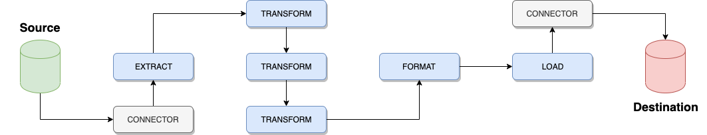

### OpenETL Agent

OpenETL is a platform to professionally manage your ETL (Extract, Transform, Load) process. The platform consists of an **Agent** as well as a **Portal**. 

Key features of te Agent includes:

* Built-in set of **extract** plugins to read data from the source system
* Built-in set of **transform** plugins to manipulate the data
* Built-in set of **format** plugins to prepare the data for the destination
* Built-in set of **load** plugins to write the data to the destination system
* Pluggable design (develop your own plugins using a simple API if not built in)
* Light-weight and easy to deploy (just a single JAR file)
* Pluggable interface for metrics

## Overview



### Extract

The **Extract** phase involves reading data from source systems. Built-in plugins include support for:

* Relational databases using JDBC (for example Oracle, SQL Server, MySQL, PostgreSQL)
* CSV files
* Microsoft Excel files

### Transform

The **Transform** phase involves manipulating the data. Built-in plugins include support for:

* Formatting date values
* Formatting numeric values
* Dropping columns
* Masking columns (for example anonymizing data)
* Renaming columns
* Trimming string values

### Format

The **Format** phase is a separation from the traditional ETL model, but very much necessary. Before loading the data, we need to define the output format. Built-in plugins include support for:

* CSV
* JSON
* JDBC (SQL statements)

### Load

The **Load** phase involves writing the data into a destination system. Built-in plugins include support for:

* Console output
* Local disk
* Relational databases using JDBC

### Summary

The **summary** phase is intended to save metrics (for example number of tables, columns and rows processed, as well as any warnings or errors) concerning the run. Built-in plugins include support for:

* Console output
* Local disk
* HTTP (POST)
* OpenETL Portal

## Download

### Requirements

* Java 1.8 or above
* Apache Ant 1.6.5 or above (if building from source)
* JUnit 4.12 or above (if running tests)

### Build from Source

* Clone this repository
* Make sure you have `java` and `ant` installed
* From the repository root, run `ant -f build.xml`
* After the build is finished, you will see the resulting JAR file in the `dist` directory, for example `openetl-agent-0.1.0.jar`
* Check out the examples in the `examples` directory

## Usage

The OpenETL Agent can be run from the command line or programmatically from your Java application. Typically, if running from the command line, multiple instances are started from the Windows Task Scheduler or Unix/Linux CRON Scheduler.

*Please note the use of multiple transforms in the examples below.*

### Command Line

**Notes**

* Be sure to add any external libraries (for example JDBC drivers) to your class path

**Windows**

```
java -cp openetl-agent-0.1.0.jar com.rtsw.openetl.agent.Agent
    -e extract.properties
    -t transform1.properties
    -t transform2.properties
    -t transform3.properties
    -f format.properties
    -l load.properties
    -s summary.properties
```

**Unix/Linux**

```
java -cp openetl-agent-0.1.0.jar com.rtsw.openetl.agent.Agent
    -e extract.properties
    -t transform1.properties
    -t transform2.properties
    -t transform3.properties
    -f format.properties
    -l load.properties
    -s summary.properties
```

### Programmatically (Java)

```
import com.rtsw.openetl.agent.Agent;

Agent agent = new Agent.Builder()
        .extract("extract.properties")
        .transform("transform1.properties")
        .transform("transform2.properties")
        .transform("transform3.properties")
        .format("format.properties")
        .load("load.properties")
        .summary("summary.properties")
        .build();

agent.run();
```

## Development

## Configuration Reference

### Extract

#### CSVExtractConnector

Extracts table, column and row information from CSV files.

**Notes**

* The original filename is used as the table name
* The first line of the file can be used to define column names

Property | Description | Required | Default value | Example value
--- | --- | --- | --- | ---
source | Source folder for input files | Yes | *None* | /tmp
filename_pattern | Include matching filenames (REGEXP) | Yes | *None* | *.csv
header | Use first line as header (column names) | No | true | *None*
recursive | Scan any possible sub-directories | No | false | *None*
separator | Separate values using this string | No | ; | *None*
drop_extension | Drop file extension from table name | No | true | *None*
infer_schema | Try to detect column type from values | No | true | *None*
infer_schema_rows | How many rows to use in detecting column type | No | 1000 | 1000
infer_schema_date_format | Date format to use in detecting date type | No | dd.MM.yyyy | *None*

infer_schema_date_format: https://docs.oracle.com/javase/8/docs/api/java/text/SimpleDateFormat.html

**Report metrics**

* Tables: Number of tables extracted (1 file = 1 table)
* Columns: Number or columns extracted from all tables
* Rows: Number of rows extracted from all tables

*Since 0.1.0*

#### ExcelExtractConnector

Extracts table, column and row information from Microsoft Excel files. Supports both XLS (Excel 97-2003 Workbook) and XLSX (Excel Workbook) formats.

**Notes**

* The sheet name is used as the table name
* The first line of the file can be used to define column names
* All columns are defaulted to a string representation
* Uses the Apache POI library (http://poi.apache.org/)

Property | Description | Required | Default value | Example value
--- | --- | --- | --- | ---
source | Source folder for input files | Yes | *None* | /tmp
filename_pattern | Include matching filenames (REGEXP) | Yes | *None* | *.csv
sheet_pattern | Include matching sheets (REGEXP) | No | *None* | Sheet1
header | Use first line as header (column names) | No | true | *None*
recursive | Scan any possible sub-directories | No | false | *None*

**Report metrics**

* Tables: Number of tables extracted (1 file = 1 table)
* Columns: Number or columns extracted from all tables
* Rows: Number of rows extracted from all tables

*Since 0.1.0*

#### JDBCExtractConnector

Extracts table, column and row information from databases supporting Java Database Connectivity (JDBC).

Property | Description | Required | Default value | Example value
--- | --- | --- | --- | ---
class_name | The JDBC driver class name | Yes | *None* | com.mysql.jdbc.Driver
url | The JDBC url | Yes | *None* | jdbc:mysql://localhost:3306/default
username | Authenticate to source database using this username | No | *None* | *None*
password | Authenticate to source database using this password | No | *None* | *None*
table_pattern | Include matching table names (REGEXP) | No | *None* | *None*
batch_size | Return this many rows at a time for a single query | No | 10000 | *None*

**Report metrics**

* Tables: Number of tables extracted
* Columns: Number or columns extracted from all tables
* Rows: Number of rows extracted from all tables

*Since 0.1.0*

#### RandomExtractConnector

Generates a table with random numbers, for testing purposes.

Property | Description | Required | Default value | Example value
--- | --- | --- | --- | ---
min_rows | Generates a minimum of this number of rows | No | 50 | *None*
max_rows | Generates a maximum of this number of rows | No | 100 | *None*
min_value | Generates values with this as a minimum (integer) | No | 50 | *None*
max_value | Generates values with this as a maximum (integer | No | 100 | *None*

**Report metrics**

* Tables: Number of tables extracted (always 1; RandomNumbers)
* Columns: Number or columns extracted from all tables (always 2; Index and Number)
* Rows: Number of rows extracted from all tables (between min_rows and max_rows)

*Since 0.1.0*

#### URLExtractConnector

Extracts table, column and row information from web pages (HTML tables).

**Notes**

* Table names are determined by: 1. name attribute, 2. id attribute, 3. generated integer sequence
* All columns are defaulted to a string representation
* Uses the JSoup library (https://jsoup.org/)

Property | Description | Required | Default value | Example value
--- | --- | --- | --- | ---
url | The web page to read | Yes | *None* | https://www.w3schools.com/html/html_tables.asp
table_pattern | Include matching tables (REGEXP) | No | *None* | *None*
connect_timeout | The max amount of milliseconds to wait for a connection | No | 10000 | *None*
read_timeout | The max amount of milliseconds to wait for a response from the server | No | 30000 | *None*
proxy | Use this HTTP proxy to connect | No | *None* | *None*
encoding | Use this character encoding | No | UTF-8 | *None*
user_agent | Use this tag to identify client request (User-Agent header) | No | openetl-agent | *None*

**Report metrics**

* Tables: Number of tables extracted
* Columns: Number or columns extracted from all tables
* Rows: Number of rows extracted from all tables

*Since 0.1.0*

### Transform

#### DateFormatTransform

Formats date values to the specified string representation.

Property | Description | Required | Default value | Example value
--- | --- | --- | --- | ---
format | Use this format to represent date values | Yes | *None* | dd.MM.yyyy HH:mm:ss
table_pattern | Apply to matching table names (REGEXP) | Yes | *None* | *None*
column_pattern | Apply to matching column names (REGEXP) | Yes | *None* | *None*

format: https://docs.oracle.com/javase/8/docs/api/java/text/SimpleDateFormat.html

**Report metrics**

* Tables: Number of tables affected
* Columns: Number of columns affected from all tables
* Rows: Number of rows transformed from all tables

*Since 0.1.0*

#### DecimalFormatTransform

Formats floating point number values to the specified string representation.

Property | Description | Required | Default value | Example value
--- | --- | --- | --- | ---
format | Use this format to represent decimal values | Yes | *None* | #.####
table_pattern | Apply to matching table names (REGEXP) | Yes | *None*
column_pattern | Apply to matching column names (REGEXP) | Yes | *None*

format: https://docs.oracle.com/javase/8/docs/api/java/text/DecimalFormat.html

**Report metrics**

* Tables: Number of tables affected
* Columns: Number of columns affected from all tables
* Rows: Number of rows transformed from all tables

*Since 0.1.0*

#### DropColumnTransform

Drops columns from tables.

Property | Description | Required | Default value | Example value
--- | --- | --- | --- | ---
table_pattern | Apply to matching table names (REGEXP) | Yes | *None* | *None*
column_pattern | Apply to matching column names (REGEXP) | Yes | *None* | *None*

**Report metrics**

* Tables: Number of tables affected
* Columns: Number of columns affected from all tables
* Rows: N/A

*Since 0.1.0*

#### MaskColumnTransform

Masks values according to the specified mask policy.

Property | Description | Required | Default value | Example value
--- | --- | --- | --- | ---
table_pattern | Apply to matching table names (REGEXP) | Yes | *None* | *None*
column_pattern | Apply to matching column names (REGEXP) | Yes | *None* | *None*
mask_policy | Mask values according to this policy | Yes | *None* | empty, hide, md5

**Mask policy:**

* empty: Replace values with empty strings ("")
* hide: Replace values with asterisks (*)
* md5: Calculate a one-way MD5 checksum from the values (performance may be impacted on larger data sets)

**Report metrics**

* Tables: Number of tables affected
* Columns: Number of columns affected from all tables
* Rows: Number of rows transformed from all tables

*Since 0.1.0*

#### NoTransform

Leaves tables and rows unaffected (for convenience where it is easier to replace properties than removing configurations).

Property | Description | Required | Default value | Example value
--- | --- | --- | --- | ---

**Report metrics**

* Tables: Number of tables affected
* Columns: Number of columns affected from all tables
* Rows: Number of rows transformed from all tables

*Since 0.1.0*

#### RenameColumnTransform

Renames columns from tables.

Property | Description | Required | Default value | Example value
--- | --- | --- | --- | ---
table_pattern | Apply to matching table names (REGEXP) | Yes | *None* | *None*
column_pattern | Apply to matching column names (REGEXP) | Yes | *None* | *None*
new_name | Rename matching columns to this | Yes | *None* | *None*

**Report metrics**

* Tables: Number of tables affected
* Columns: Number of columns affected from all tables
* Rows: N/A

*Since 0.1.0*

#### TrimColumnTransform

Trims string values (removes empty spaces from the beginning and end).

Property | Description | Required | Default value | Example value
--- | --- | --- | --- | ---
table_pattern | Apply to matching table names (REGEXP) | Yes | *None* | *None*
column_pattern | Apply to matching column names (REGEXP) | Yes | *None* | *None*
trim_name | Trim column name | No | true | *None*
trim_value | Trim column value (string type) | No | true | *None*

**Report metrics**

* Tables: Number of tables affected
* Columns: Number of columns affected from all tables
* Rows: Number of rows transformed from all tables

*Since 0.1.0*

### Format

#### CSVFormat

Property | Description | Required | Default value | Example value
--- | --- | --- | --- | ---
column_separator | Separate columns using this string | No | ; | *None*
line_separator | Separate lines using this string | No | \n | *None*
header | Include column names as first line | No | true | *None*
encoding | Use this character encoding | No | UTF-8 | *None*

**Report metrics**

* Tables: Number of tables processed
* Columns: Number of columns processed from all tables
* Rows: Number of rows processed from all tables

*Since 0.1.0*

#### JDBCFormat

Property | Description | Required | Default value | Example value
--- | --- | --- | --- | ---

**Report metrics**

* Tables: Number of tables processed
* Columns: Number of columns processed from all tables
* Rows: Number of rows processed from all tables

*Since 0.1.0*

#### JSONFormat

Property | Description | Required | Default value | Example value
--- | --- | --- | --- | ---
pretty | Pretty-print output | No | false | *None*
encoding | Use this character encoding | No | UTF-8 | *None*

**Report metrics**

* Tables: Number of tables processed
* Columns: Number of columns processed from all tables
* Rows: Number of rows processed from all tables

*Since 0.1.0*

### Load

#### ConsoleLoadConnector

Property | Description | Required | Default value | Example value
--- | --- | --- | --- | ---

**Report metrics**

* Tables: Number of tables loaded
* Columns: Number of columns loaded from all tables
* Rows: Number of rows loaded from all tables

*Since 0.1.0*

#### DiskLoadConnector

Property | Description | Required | Default value | Example value
--- | --- | --- | --- | ---
destination | Destination folder for output files | Yes | *None* | *None*
compress | Compress output files using GZIP | No | false | *None*

**Report metrics**

* Tables: Number of tables loaded
* Columns: Number of columns loaded from all tables
* Rows: Number of rows loaded from all tables

*Since 0.1.0*

#### JDBCLoadConnector

Property | Description | Required | Default value | Example value
--- | --- | --- | --- | ---
class_name | The JDBC driver class name | Yes | *None* | com.mysql.jdbc.Driver
url | The JDBC url | Yes | *None* | jdbc:mysql://localhost:3306/default
username | Authenticate to destination database using this username | No | *None* | *None*
password | Authenticate to destination database using this password | No | *None* | *None*

**Report metrics**

* Tables: Number of tables loaded
* Columns: Number of columns loaded from all tables
* Rows: Number of rows loaded from all tables

*Since 0.1.0*

### Summary

#### ConsoleSummaryPusher

Displays a summary of the agent run on the local console.

Property | Description | Required | Default value | Example value
--- | --- | --- | --- | ---
title | A title for this specific agent | Yes | *None* | *None*
description | A description for this specific agent | No | *None* | *None*
pretty | Pretty-print output | No | true | *None*

*Since 0.1.0*

#### DiskSummaryPusher

Writes a summary of the agent run to a disk system.

Property | Description | Required | Default value | Example value
--- | --- | --- | --- | ---
destination | Destination folder for the summary file | Yes | *None*  | *None*
title | A title for this specific agent | Yes | *None* | *None*
description | A description for this specific agent | No | *None* | *None*
filename | Filename for the summary file | No | summary.json | *None*
compress | Compress the summary file using GZIP | No | false | *None*
encoding | Use this character encoding | No | UTF-8 | *None*
pretty | Pretty-print output | No | false | *None*

*Since 0.1.0*

#### HTTPSummaryPusher

Sends a summary of the agent run to a remote URL using HTTP POST.

Property | Description | Required | Default value | Example value
--- | --- | --- | --- | ---
url | The remote URL | Yes | http://localhost:8080/ | *None*
connect_timeout | The max amount of milliseconds to wait for a connection | No | 10000 | *None*
read_timeout | The max amount of milliseconds to wait for a response from the server | No | 30000 | *None*
encoding | Use this character encoding | No | UTF-8 | *None*
proxy | Use this HTTP proxy to send the summary | No | *None* | *None*
username | The username for HTTP basic access authentication | No | *None* | *None*
password | The password for HTTP basic access authentication | No | *None* | *None*

Authentication: https://en.wikipedia.org/wiki/Basic_access_authentication

*Since 0.1.0*

#### PortalSummaryPusher

Sends a summary of the agent run to the OpenETL Portal.

Property | Description | Required | Default value | Example value
--- | --- | --- | --- | ---
organization | Your organization id in OpenETL Portal | Yes | *None* | *None*
apikey | Your organization API key in OpenETL Portal | Yes | *None* | *None*
title | A title for this specific agent | Yes | *None* | *None*
description | A description for this specific agent | No | *None* | *None*
url | The OpenETL Portal API URL | No | https://openetl-portal.appspot.com/api/v1/summary | *None*
connect_timeout | The max amount of milliseconds to wait for a connection | No | 10000 | *None*
read_timeout | The max amount of milliseconds to wait for a response from the server | No | 30000 | *None*
encoding | Use this character encoding | No | UTF-8 | *None*
proxy | Use this HTTP proxy to send the summary | No | *None* | *None*

*Since 0.1.0*